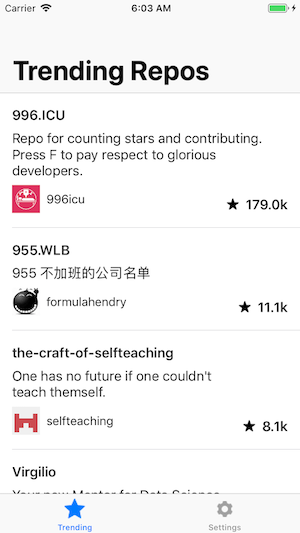

# GithubStars

A small app that will list the most starred Github repos that were created in the last 30 days. 

[![Swift Version][swift-image]][swift-url]
[![Build Status][travis-image]][travis-url]
[![License][license-image]][license-url]


The application is Structured using the MVVM-Coordinator Pattern with a protocol oriented approach and RxSwift was used for reactive programming.



## Installation

Download the repository manually and open it using xcode 10.1 and it should run normally.


## Development setup

The application contains 3 third party dependencies install using cocoapods:

1- [RxSwift](https://github.com/ReactiveX/RxSwift) <br />
2- [RxCocoa](https://github.com/ReactiveX/RxSwift/tree/master/RxCocoa) <br />
3- [Kingfisher](https://github.com/onevcat/Kingfisher) <br />

If you have any problem running the code update the pods as follows:

```sh
pod update
```


## Meta

Jaafar Barek – [@BarekJaafarr](https://twitter.com/BarekJaafar) – Jaafarbarek@gmail.com

Distributed under the MIT license.

[https://github.com/jaafarbarek](https://github.com/jaafarbarek)

[swift-image]:https://img.shields.io/badge/swift-4.2-orange.svg
[swift-url]: https://swift.org/
[license-image]: https://img.shields.io/badge/License-MIT-blue.svg
[license-url]: LICENSE
[travis-image]: https://img.shields.io/travis/dbader/node-datadog-metrics/master.svg
[travis-url]: https://travis-ci.org/dbader/node-datadog-metrics
[codebeat-image]: https://codebeat.co/badges/c19b47ea-2f9d-45df-8458-b2d952fe9dad
[codebeat-url]: https://codebeat.co/projects/github-com-vsouza-awesomeios-com
